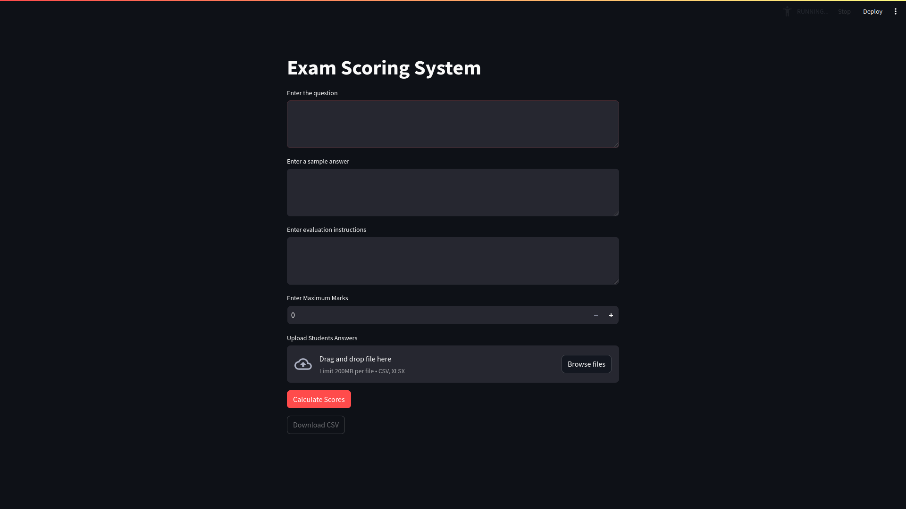

# Exam Scoring System

This Streamlit app automates the scoring of student exams using OpenAI's GPT models. It offers a user-friendly interface to input questions, set parameters, upload responses, and export scores.



## Installation

Clone the repo and install dependencies:
```bash
git clone https://github.com/SSKlearns/llm-for-evaluation.git
cd llm-for-evaluation
pip install -r requirements.txt
```

## Usage

Run the app with:
```bash
streamlit run app.py
```
Access it at `http://localhost:8501`.

## Contributing

Contributions are welcome. Kindly create a PR with any meaningful contributions.